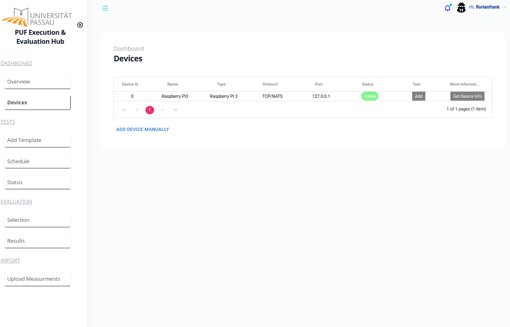
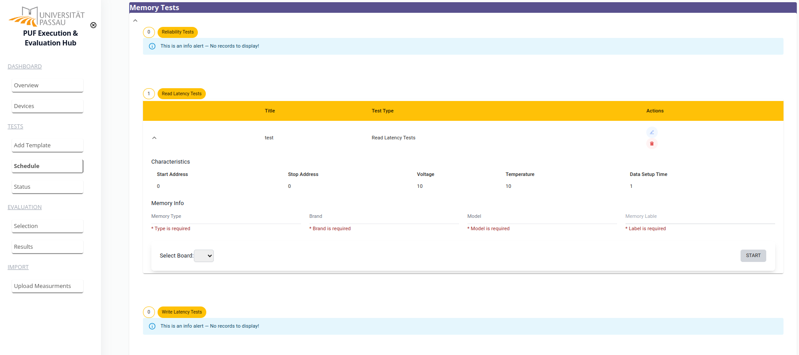

# Frontend Implementation for a PUF Execution and Evaluation Platform

This repo contains the development of the frontend to execute, filter and analyse PUF-related (Physical Unclonable Function)  behavior tests. The execution and evaluation platform was successfully was developed as part of the DFG projects:

1. [Nano Security: Von Nanoelektronik zu Sicheren Systemen](https://gepris.dfg.de/gepris/projekt/422730034?context=projekt&task=showDetail&id=422730034&)
2. [Intrinsische Physical Unclonable Functions aus neuartigen nichtflüchtigen Speichern](https://gepris.dfg.de/gepris/projekt/440182124)

The initial version of the platform was created as part of [El khayari Abderrazzak's](https://github.com/elkhayari) master's thesis.

## Platform Features

- **Test Template Definition:** Users can define test templates for various PUF types, such as memory-based PUFs (e.g., SRAM, DRAM) and PUFs on passive circuit elements (e.g., memristors or CNT-FETs). Additionally, custom tests can be scripted.




- **Device Management:** The platform ables device detection, allowing users to add devices for test execution. It also supports scheduling tests on multiple devices in parallel.



- **Results Visualization:** Users can visually explore and filter measurement results easily.

- **Test Result Evaluation:** The platform enables the evaluation and visualization of test results, providing valuable insights.

- **Data Upload:** Users can upload existing measurements, seamlessly integrating them into the platform's database.

- **Authentication and Rights Management:** The platform ensures secure multi-user access with authentication and rights management features, granting users access to specific data based on their roles.

- **Integration with Measurement Instruments:** Seamless integration with measurement instruments such as DC Power Supplies, Oscilloscopes, SMUs, and Signal Generators is achieved through the use of the [instrument control library](https://github.com/FlorianFrank/instrument_control_lib).


## Preliminaries & Installation

The platform is written as [React](https://react.dev/) Application utilizing [Material UI](https://mui.com/) design elements.

To install the required packages, the following commands must be executed:

```bash
sudo apt-get install nodejs npm
cd ./puf_frontend
npm install
```

The application can be started by the command:

```
npm start
```

Now the frontend is accessible over [http://localhost:3000](http://localhost:3000).

## Backend Integration

The platform requires a backend implementation. Currently, a Django backend server has been implemented, providing the necessary endpoints. However, it is stored in a closed repository due to the sensitivity of the algorithms involved. This ensures the protection of proprietary information and algorithms utilized in the platform's operation.
An overview of the required endpoints is provided below.


